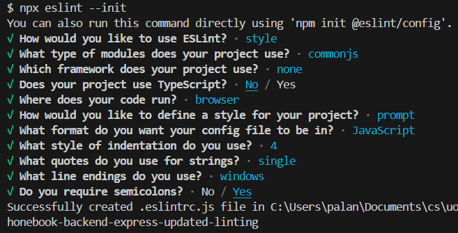

# uoh-fullstack-open-2023-part3

## Phonebook application - University of Helsinki (Deep Dive Into Modern Web Development, Part 3: Programming a server with NodeJS and Express)

Environment Variables:
- `MONGODB_URI`
- `PORT=3001`

Install dependencies from the root of the project/application:

```bash
npm i
```

To run the application, in the terminal run the below command:

- For practice purposes:

```bash
node mongo.js yourpassword Anna 040-1234556

node mongo.js yourpassword "Arto Vihavainen" 045-1232456

node mongo.js yourpassword
```

- Actual notes application:

```bash
npm start
```

- To run the application with nodemon: 

```bash
npm run dev
```

Linting (Updated with ESLint Stylistic Plugin):

- To run lint on the whole project:

```bash
npm run lint
```

- Inspecting and validating a single file:

```bash
npx eslint index.js
```

---

On the browser, visit for get requests:

- http://localhost:3001
- http://localhost:3001/info
- http://localhost:3001/api/persons
- http://localhost:3001/api/persons/1

You can also perform these operations on Postman/VS Code REST client.

---

REST HTTP Methods for the notes application:

| URL           | verb   | functionality                                                          |
| ------------- | ------ | ---------------------------------------------------------------------- |
| info          | GET    | fetches the total number of entries in the collection and current date |
| api/persons   | GET    | fetches all resources in the collection                                |
| api/persons/1 | GET    | fetches a single resource                                              |
| api/persons   | POST   | creates a new resource based on the request data                       |
| api/persons/1 | PUT    | replaces the entire identified resource with the request data          |
| api/persons/1 | DELETE | removes the identified resource                                        |

---

## Part 3 - (a) Node.js and Express

Exercises 3.1 - 3.8 --> phonebook backend express server app

## Part 3 - (b) Deploying app to internet

Exercises 3.9 - 3.11 --> phonebook backend express server app (contd. from part 3a)

## Part 3 - (c) Saving data to MongoDB

phonebook backend express server app (contd. from part 3b)

Exercises 3.12 --> Command line database

Exercises 3.13 - 3.14 --> Phonebook database

Exercises 3.15 - 3.18 --> Phonebook database

NOTE: To get the `dist` directory, run the command `npm run build` from the `phonebook-frontend` application and then copy the `dist` folder from the frontend folder to the backend folder. Open the application on `http://localhost:3001/` to view the frontend. The server and the application can be seen running together here.

## Part 3 - (d) Validation and ESLint

Exercises 3.19 - 3.21 --> Phonebook database & deploying the database backend to production

Exercise 3.22 --> Lint configuration

### Requirements for the application:

1. Express - Express.js, or simply Express, is a back end web application framework for building RESTful APIs with Node.js

```bash
npm install express
```

2. Nodemon - reload, automatically

```bash
npm install --save-dev nodemon
```

3. Morgan middleware (HTTP request logger middleware for node.js)

```bash
npm install morgan
```

4. REST Client Plugin (by Huachao Mao) in VSCode to run the request from the `.rest` files or use Postman

5. CORS middleware (Cross-Origin Resource Sharing)

```bash
npm install cors
```

6. Deployed on [render](https://render.com/) - Cloud Application Hosting for Developers

https://phonebook-app-zim0.onrender.com/

When the app is deployed in Render, make sure that the env variables from this project is saved in the Render web service --> Environment

7. MongoDB Atlas - A MongoDB provider. Create an account (here)[https://www.mongodb.com/atlas/database] and choose the free option. (MongoDB is a document-oriented NoSQL database)

8. Mongoose - Object Document Mapper library for MongoDB

```bash
npm install mongoose
```

9. dotenv - used for environment variables in a `.env` file

```bash
npm install dotenv
```

NOTE: Store the `MONGODB_URI` and `PORT` env variables in the `.env` file. Get the value for the`MONGODB_URI` from the render hosted app.

10. ESLint - tool for static analysis (aka "linting") that detects and flags errors in programming languages, including stylistic errors

```bash
npm install eslint --save-dev
```

To initialize a default ESlint configuration:

```bash
npx eslint --init
```

Questions to answer after running the above command:

- How would you like to use ESLint? To check syntax, find problems, and enforce code style
- What type of modules does your project use? CommonJS (require/exports)
- Which framework does your project use? None of these
- Does your project use TypeScript? No
- Where does your code run? Browser
- How would you like to define a style for your project? Answer questions about your style
- What format do you want your config file to be in? JavaScript
- What style of indentation do you use? Spaces
- What quotes do you use for strings? Single
- What line endings do you use? Windows
- Do you require semicolons? Yes



or

```bash
npm init @eslint/config
```

10. ESLint Stylistic - a plugin that defines a set of code style-related rules; stylistic Formatting
for ESLint (formatting and Linting in one go, with fully customizable rules)

```bash
npm install --save-dev @stylistic/eslint-plugin-js
```

11. ESLint plugin extension (by Microsoft) integrates ESLint JavaScript into VS Code
